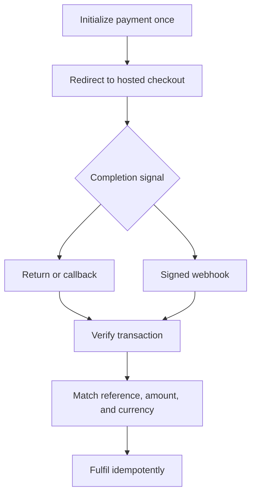

# `@sye1321/nestjs-chapa`

[](https://www.npmjs.com/package/@sye1321/nestjs-chapa)
[](https://github.com/Sye-1321/nestjs-chapa/actions/workflows/ci.yml)
[](https://github.com/Sye-1321/nestjs-chapa/actions/workflows/codeql.yml)
[](LICENSE)

A NestJS-native integration for Chapa payments, published on npm as [`@sye1321/nestjs-chapa`](https://www.npmjs.com/package/@sye1321/nestjs-chapa).

The happy path for accepting a payment looks simple: initialize a transaction, redirect the customer, and wait for completion. The difficult part begins when a request times out after reaching the provider, a return URL arrives without authoritative payment proof, a webhook body is parsed before its signature is checked, or an application retries an operation whose outcome is uncertain.

This library packages those boundaries into a typed NestJS integration with explicit retry behavior, exact-raw-body webhook verification, normalized errors, deterministic ESM and CommonJS builds, and compile-checked consumer examples.

> This is a community-maintained integration. It is not an official Chapa SDK and is not endorsed by Chapa.

**Stable release:** `v1.0.0`

**Supported environments:** Node.js 22 and 24, NestJS 10 and 11, ESM and CommonJS

## Why this library exists

A payment integration is more than an HTTP client.

The host application needs to configure credentials safely, initialize and verify transactions, distinguish safe retries from uncertain outcomes, authenticate webhook bytes before trusting their contents, normalize provider failures, and work consistently across NestJS and Node.js module formats.

`@sye1321/nestjs-chapa` centralizes those responsibilities without pretending to own the application's orders, persistence, fulfilment, authorization, or reconciliation.

## Payment flow



Return and callback URLs are navigation signals, not authoritative proof of payment. Webhook verification authenticates the incoming bytes, but it does not fulfil an order. The host application must verify the transaction, match it to the expected business record, and make fulfilment idempotent.

## Responsibilities

| The SDK handles                                   | The host application owns                               |
| ------------------------------------------------- | ------------------------------------------------------- |
| NestJS synchronous and asynchronous configuration | Secure credential and secret management                 |
| Hosted payment initialization and verification    | Transaction-reference uniqueness and persistence        |
| Hosted checkout cancellation                      | Order ownership and authorization                       |
| Banks and currencies metadata                     | Matching the expected reference, amount, and currency   |
| Local transaction-reference generation            | Idempotent fulfilment and webhook processing            |
| Exact-raw-body webhook signature verification     | Redirect, callback, and webhook routing                 |
| Typed errors and redacted diagnostics             | Reconciliation, operational recovery, and audit records |
| Bounded retries for eligible safe reads           | Protection of logs and stored provider payloads         |
| ESM and CommonJS package compatibility            | HTTPS termination and production infrastructure         |

## Install

```bash
npm install @sye1321/nestjs-chapa
```

```bash
pnpm add @sye1321/nestjs-chapa
```

## Configure NestJS

Register the module when configuration is already available:

```ts
import { Module } from '@nestjs/common';
import { ChapaModule } from '@sye1321/nestjs-chapa';

@Module({
  imports: [
    ChapaModule.register({
      secretKey: process.env.CHAPA_SECRET_KEY!,
      webhookSecret: process.env.CHAPA_WEBHOOK_SECRET
    })
  ]
})
export class AppModule {}
```

`ChapaModule.registerAsync()` supports Nest-managed factories, `useClass`, `useExisting`, `imports`, and dependency injection.

Inject the framework-managed service rather than constructing it directly:

```ts
import { Injectable } from '@nestjs/common';
import { ChapaService } from '@sye1321/nestjs-chapa';

@Injectable()
export class CheckoutService {
  constructor(private readonly chapa: ChapaService) {}
}
```

The default API base URL is `https://api.chapa.co/v1`.

A custom `baseUrl` receives the configured authorization credential. Use one only for a trusted proxy or controlled testing environment. Never send production credentials to an untrusted host.

## Initialize and verify a payment

```ts
import { Injectable } from '@nestjs/common';
import { ChapaService } from '@sye1321/nestjs-chapa';

@Injectable()
export class CheckoutService {
  constructor(private readonly chapa: ChapaService) {}

  async startPayment() {
    const txRef = this.chapa.references.generate({
      prefix: 'order'
    });

    const payment = await this.chapa.payments.initialize({
      amount: '125.50',
      currency: 'ETB',
      txRef,
      email: 'customer@example.test',
      meta: {
        cartId: 'fictional-cart-42'
      }
    });

    return {
      txRef,
      checkoutUrl: payment.checkoutUrl
    };
  }

  async verifyBeforeFulfilment(txRef: string) {
    const payment = await this.chapa.payments.verify(txRef);

    const matchesExpectedPayment =
      payment.status === 'success' && payment.amount === '125.50' && payment.currency === 'ETB';

    if (matchesExpectedPayment) {
      // Fulfil exactly once using application-owned persistence.
    }

    return payment;
  }
}
```

### Important payment rules

- Initialization uses `POST` and is never retried automatically.
- A timeout during initialization is an uncertain outcome. Do not blindly create another transaction.
- Verification is a safe `GET` and may receive bounded retries.
- An HTTP `404` remains a `ChapaApiError`; it is not converted into a pending payment.
- The host application owns `txRef` uniqueness.
- Do not parse provider messages to infer a stable duplicate-reference code.
- Verify the transaction before making fulfilment decisions.
- Match the expected reference, amount, and currency before fulfilling.
- Make fulfilment idempotent.
- Hosted checkout cancellation does not prove a universal cancelled transaction state. Verify before making business decisions.

Metadata reads are available through:

```ts
const banks = await this.chapa.metadata.listBanks();
const currencies = await this.chapa.metadata.listCurrencies();
```

These are provider reads and are not cached.

Transaction-reference generation is local and makes no provider request:

```ts
const txRef = this.chapa.references.generate({
  prefix: 'order'
});
```

## Verify webhooks

Webhook verification requires the exact incoming bytes. Never parse and reserialize the JSON body before verifying its signature.

Enable raw-body support when creating an Express application:

```ts
return NestFactory.create<NestExpressApplication>(SynchronousExampleModule, {
  rawBody: true
});
```

Pass the raw bytes and incoming headers to the verifier:

```ts
const verified = this.chapa.webhooks.verify({
  rawBody: request.rawBody!,
  headers: request.headers
});
```

After verification, the host application must still:

- record webhook-processing state;
- reject duplicate processing;
- verify the transaction when appropriate;
- match the expected reference, amount, and currency;
- fulfil the related business operation idempotently.

Complete compile-checked examples are available for both adapters:

- [`examples/express-webhook.ts`](examples/express-webhook.ts)
- [`examples/fastify-webhook.ts`](examples/fastify-webhook.ts)

## Errors and diagnostics

All SDK errors extend `ChapaError`.

```ts
try {
  const payment = await this.chapa.payments.verify(txRef);
} catch (error) {
  if (error instanceof ChapaError) {
    console.error(error.toJSON());
  }

  throw error;
}
```

The base error exposes safe diagnostic fields including:

- `code`
- `operation`
- `httpStatus`
- `attempts`
- `retryable`

Specific subclasses include `ChapaValidationError`, `ChapaTimeoutError`, and `ChapaWebhookSignatureError`.

`toJSON()` returns a redacted diagnostic object. Raw provider data remains untrusted and may contain business information, so the host application must control where it is logged or stored.

## Testing applications that use the SDK

Custom transports allow unit tests to remain deterministic and provider-offline. The testing entry point can also generate a valid signature for fictional webhook bytes:

```ts
import { generateChapaTestSignature } from '@sye1321/nestjs-chapa/testing';

const signature = generateChapaTestSignature({
  rawBody,
  secret: 'fictional-webhook-secret'
});
```

See [`examples/testing.ts`](examples/testing.ts) for the compile-backed transport and webhook-testing examples.

Never place production credentials in fixtures.

## Engineering evidence

The package is verified through more than unit tests.

| Area                   | Evidence                                                     |
| ---------------------- | ------------------------------------------------------------ |
| Public API             | API Extractor checks the committed public contract           |
| Package output         | Deterministic ESM and CommonJS builds                        |
| Consumer compatibility | Packed consumers covering Node.js 22/24 and NestJS 10/11     |
| Coverage               | Minimum 90% statements and lines, 85% functions and branches |
| Examples               | Canonical TypeScript examples are compile-checked            |
| Package contents       | The packed npm artifact is inspected before release          |
| Reproducibility        | Deterministic-build verification                             |
| Security               | Provider-offline CI and CodeQL                               |
| Publishing             | npm Trusted Publishing through GitHub OIDC with provenance   |

Run the complete provider-offline maintainer gate with:

```bash
corepack enable
pnpm install --frozen-lockfile
pnpm verify
pnpm changeset:status
```

`pnpm verify` runs formatting, linting, type checking, clean builds, API checks, the SDK test suite, coverage enforcement, determinism checks, package inspection, and packed-consumer compatibility tests.

## How V1 was built

The public API was not designed only from endpoint names.

The project moved through a deliberate sequence:

1. Provider behavior was investigated and recorded for selected Chapa Test Mode scenarios.
2. Conflicting or incomplete observations were adjudicated in a retained contract-freeze record.
3. The supported V1 behavior was frozen in a normative technical specification.
4. Core contracts, payment operations, metadata, webhook verification, and NestJS integration were implemented against that specification.
5. ESM, CommonJS, Node.js, NestJS, packaging, and consumer compatibility were verified.
6. The release-candidate contract was promoted to `v1.0.0` without changing its public API or runtime behavior.

Evidence and decisions are retained in:

- [Contract evidence](docs/contracts/README.md)
- [V1 technical specification](docs/specification/TECHNICAL_SPECIFICATION.md)
- [Sanitized Test Mode fixtures](test/fixtures/chapa)
- [Changelog](CHANGELOG.md)
- [Production integration guide](docs/guides/production-integration.md)

The retained Test Mode evidence covers specific recorded scenarios. It is not a universal guarantee of all live-environment provider behavior.

## V1 scope

V1 includes:

- hosted payment initialization;
- transaction verification;
- hosted checkout cancellation;
- transaction-reference generation;
- banks metadata;
- supported-currencies metadata;
- exact-raw-body webhook verification;
- typed errors and redacted diagnostics;
- bounded retries for eligible safe reads;
- synchronous and asynchronous NestJS configuration;
- ESM and CommonJS package builds;
- testing utilities and compile-checked examples.

The following remain outside V1:

- refunds;
- transfers;
- subaccounts;
- subscriptions;
- direct charge;
- virtual accounts;
- balances;
- foreign exchange;
- tax functionality.

New provider behavior requires an approved evidence milestone and a technical-specification revision before becoming supported SDK behavior.

## Production guidance

Before deploying an integration, read the [production integration guide](docs/guides/production-integration.md).

It covers lifecycle recovery, retry boundaries, webhook security, secret ownership, application responsibilities, and operational failure handling.

## Contributing

Contributions should preserve the frozen public contract, provider-offline verification, and explicit responsibility boundaries.

Read:

- [Contributing guide](CONTRIBUTING.md)
- [Governance](GOVERNANCE.md)
- [Security policy](SECURITY.md)
- [Support policy](SUPPORT.md)
- [Roadmap](ROADMAP.md)
- [Maintainers](MAINTAINERS.md)

## License

Licensed under the [MIT License](LICENSE).
